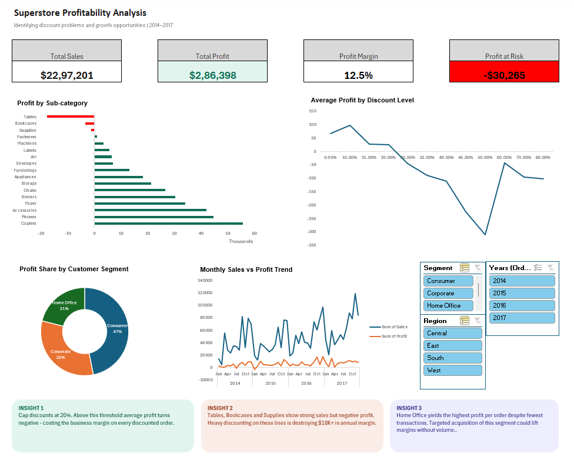

# Superstore Profitability Analysis
**Tool:** Microsoft Excel | **Type:** Business Analysis Dashboard

## Business Problem
A retail company is growing revenue year on year but profit margins 
are not keeping pace. The goal of this analysis was to identify 
which products, customer segments, and discount practices are 
driving or destroying profitability and recommend specific 
actions to fix them.

## Dataset
- Source: [Superstore Dataset — Kaggle](https://www.kaggle.com/datasets/vivek468/superstore-dataset-final)
- 9,994 rows of retail transaction data
- Fields: Order ID, Customer ID, Product ID, Category, 
  Sub-Category, Sales, Profit, Discount, Segment, Region, Order Date

## Data Cleaning
- Identified and resolved mixed date formats (DD/MM/YYYY and 
  DD-MM-YYYY) using Excel's Text to Columns
- Removed duplicate entries and verified data integrity 
  across all columns
- Created calculated fields for Profit Margin and Profit per Order

## Analysis Approach
Built pivot tables to answer 4 specific business questions:
1. Which sub-categories are profitable vs loss-making?
2. At what discount level does profit turn negative?
3. Which customer segment drives the most value?
4. Is profitability keeping pace with revenue growth over time?

## Key Findings

### Finding 1 - Discount sweet spot
A 10% discount maximises average profit. Above 20% discount, 
average profit turns negative. The business is losing money 
on every heavily discounted order.

### Finding 2 - Three loss-making sub-categories
Tables (-$18K), Bookcases (-$3K) and Supplies (-$1K) generate 
strong sales volume but negative profit - concentrated evidence 
of discount abuse on specific product lines.

### Finding 3 - Hidden high-value segment
Home Office places the fewest orders (1,783) but generates 
the highest profit per order ($33.8), compared to Consumer 
at $25.8 - making it the most efficient segment per transaction.

### Finding 4 - Revenue-profit gap
Sales grew consistently 2014–2017 but profit did not grow 
at the same rate - indicating margin erosion from discounting 
as the business scaled.

## Business Recommendations
1. **Cap all discounts at 20%** across the product catalogue
2. **Review pricing on Tables, Bookcases and Supplies** - 
   either reprice or enforce discount limits on these lines
3. **Launch targeted acquisition campaign for Home Office 
   segment** - highest ROI per customer acquired

## Dashboard

## Skills Demonstrated
- Data cleaning and preparation in Excel
- Pivot table analysis and calculated fields
- Dashboard design with slicers and interactive charts
- Business insight generation from raw data
- Translating data findings into actionable recommendations
